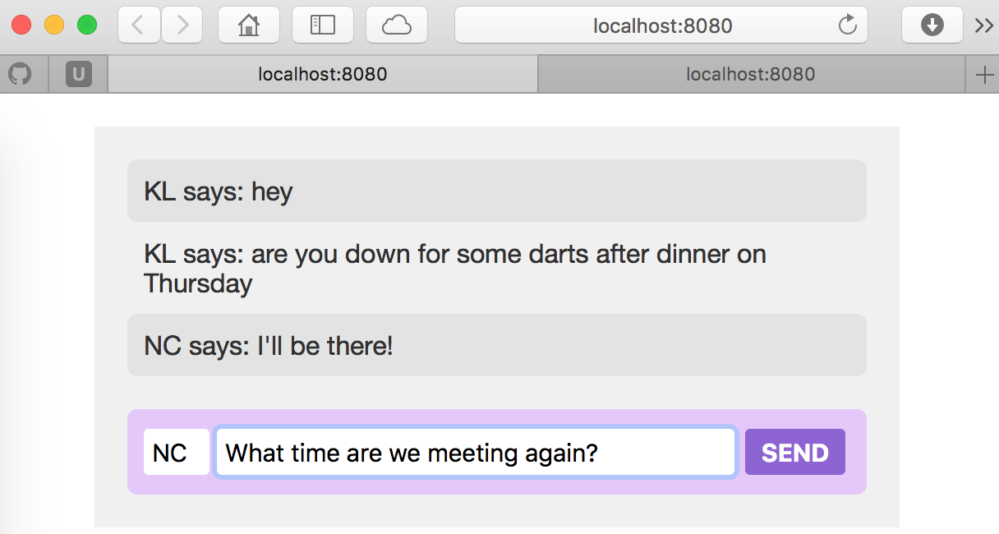
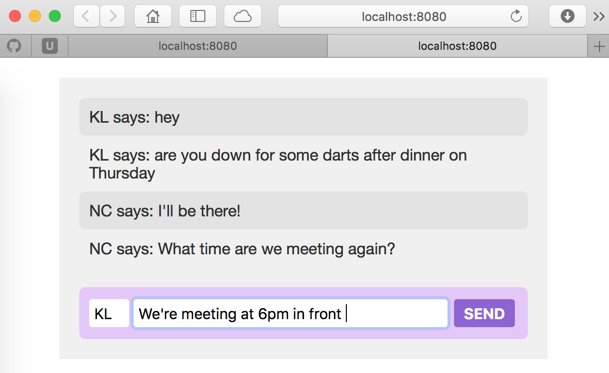
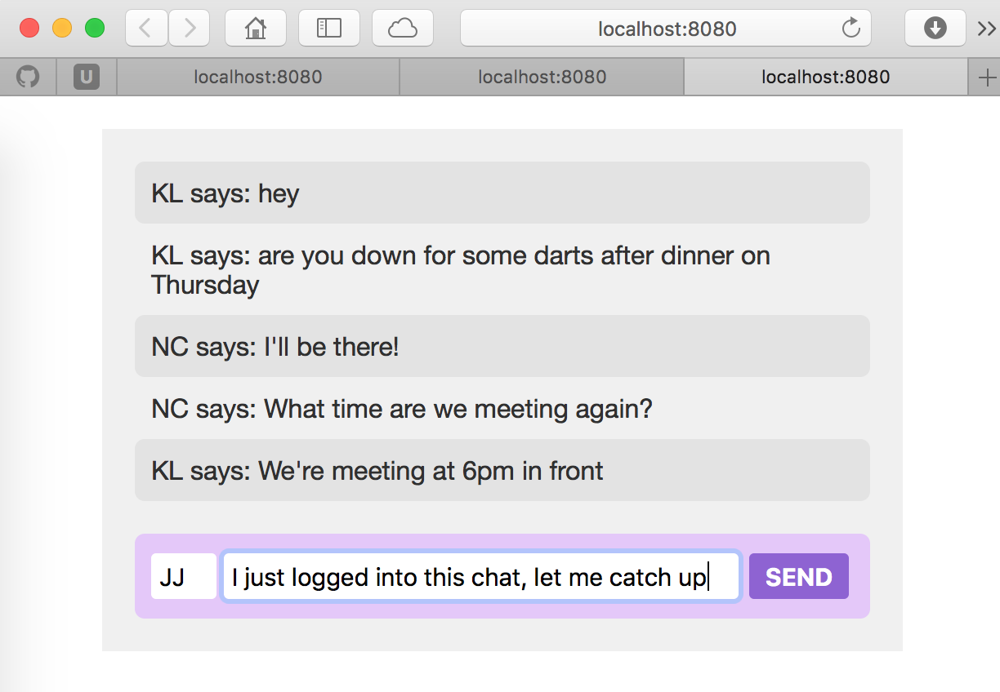

# jsWebChatApp
Simple chat application to learn web programming.

### Built With

* [socket.io](http://socket.io/) - The web application framework used for server (Node) and client (browser) communication
* [Espress](https://expressjs.com) - The web application framework used for web server

### Getting Started

First ```npm install socket.io``` and ```npm install express```.

Then, we need to have the Node server running. Run ```node server.js```.

Finally, launch the chat application from a Web browser with URL ```localhost:8080 ``` and another client from another browser (or new tab). Now the two chat clients can talk to each other.

### Screenshot(s)




### Acknowledgements
* Followed [JavaScript Essentials](https://github.com/lighthouse-labs/gitbook-node-chat-tutorial) tutorial created David VanDusen
* Read through [PurpleBooth's Readme Template](https://gist.github.com/PurpleBooth/109311bb0361f32d87a2) to create readme
* Read through [GitHub Mastering Markdown](https://guides.github.com/features/mastering-markdown/) to create readme
* [lebentle][http://github.com/lebentle] for her help looking at server.js to fix stretch goal 3 bug
